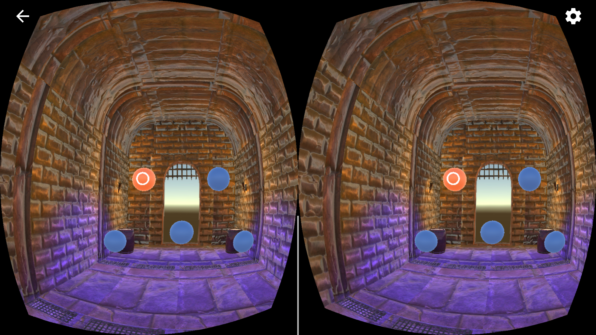
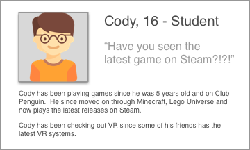
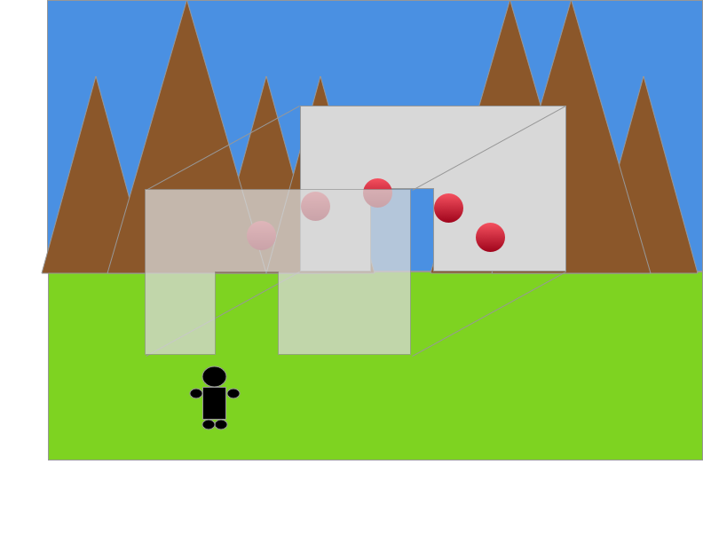
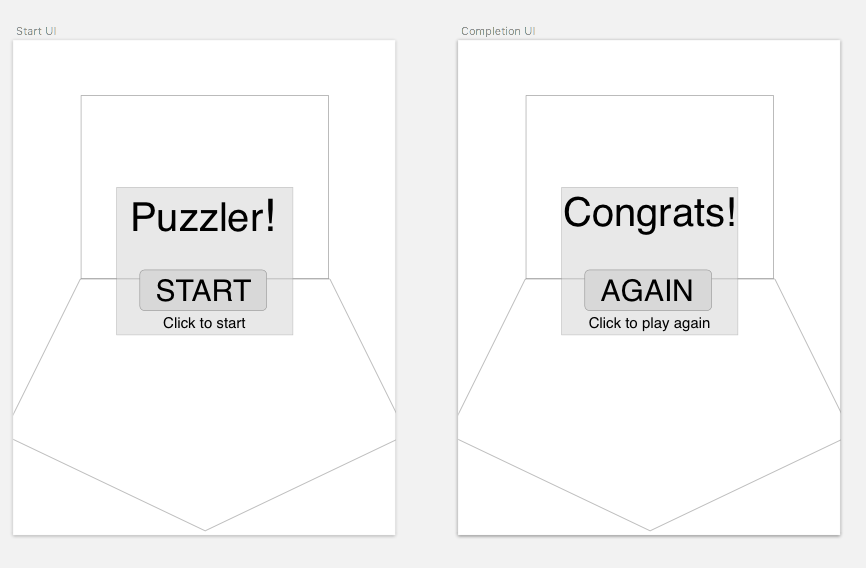
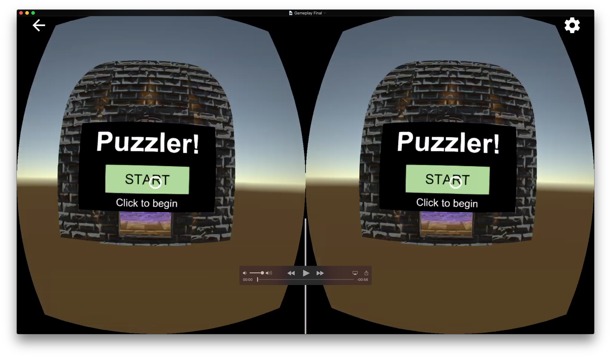
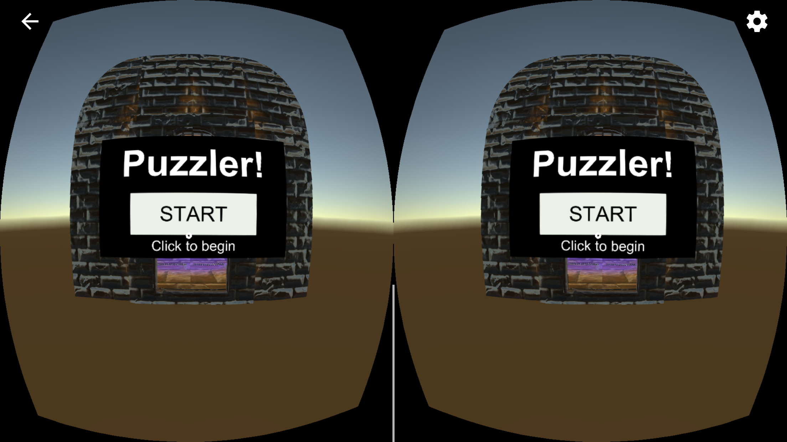
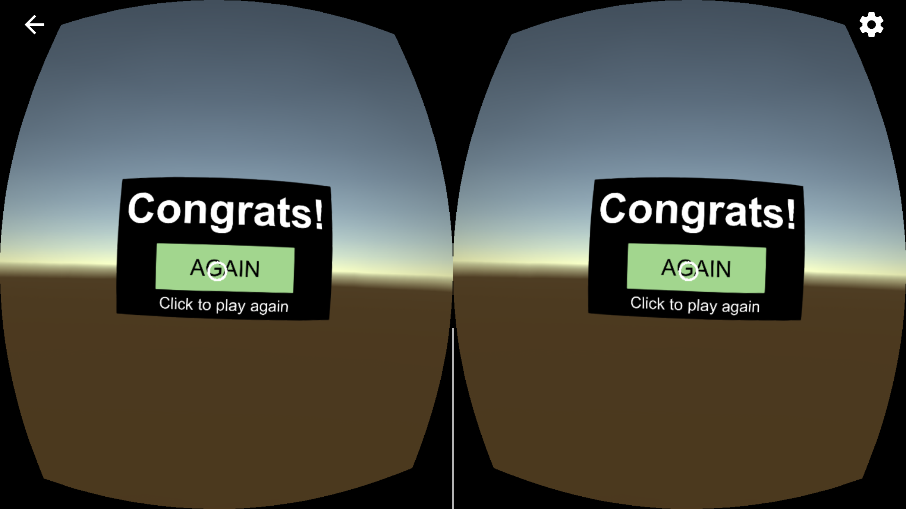
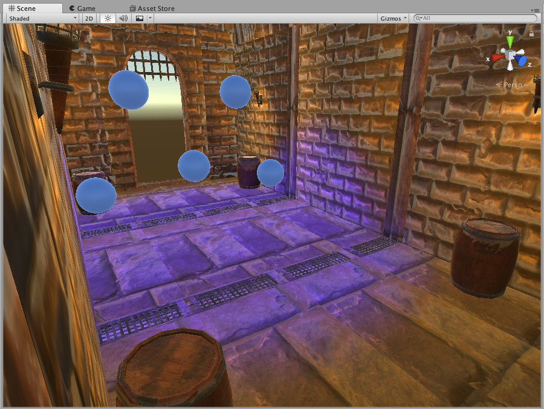
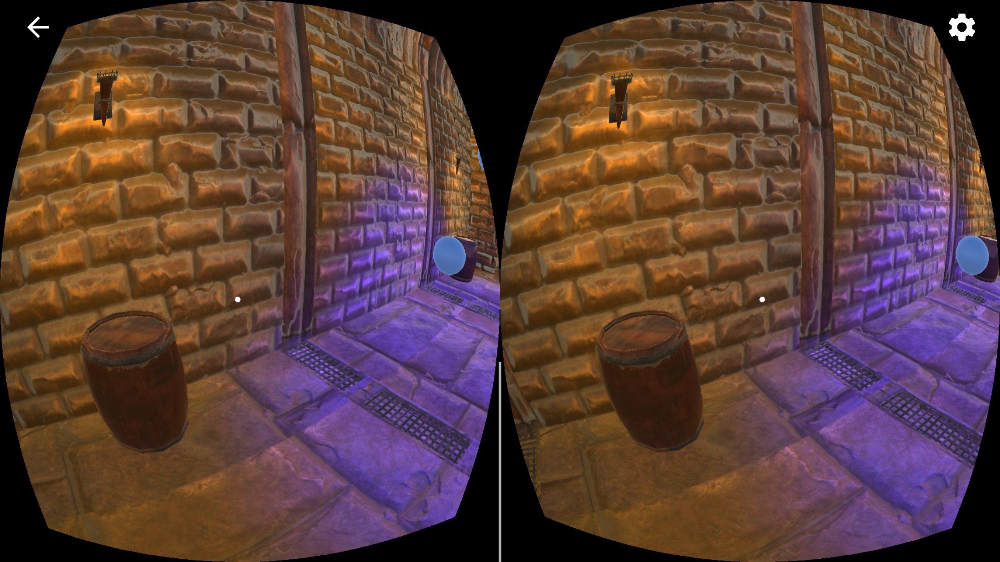
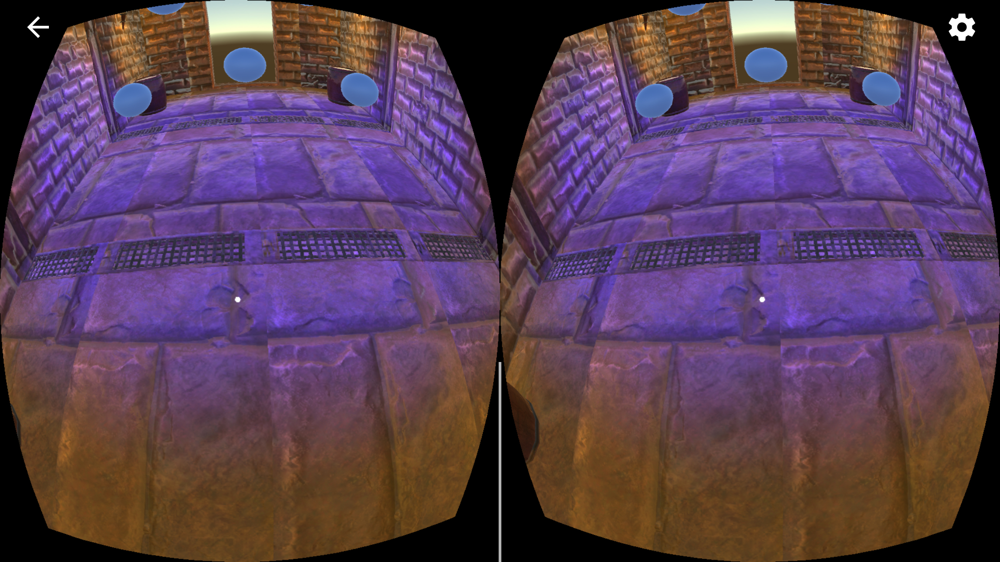

# Designing For Virtual Reality

- [Designing For Virtual Reality](#designing-for-virtual-reality)
    - [Puzzler Game](#puzzler-game)
    - [Process](#process)
        - [Persona](#persona)
        - [Sketches](#sketches)
            - [Environment](#environment)
            - [User Interface](#user-interface)
    - [User Testing](#user-testing)
        - [User Test 1 - Mood](#user-test-1---mood)
        - [User Test 2 - UI](#user-test-2---ui)
        - [User Test 3 - Movement](#user-test-3---movement)
    - [Final Result](#final-result)
        - [User Interface](#user-interface)
        - [Mood](#mood)
            - [Lighting](#lighting)
            - [Sound](#sound)
    - [Conclusion](#conclusion)
        - [Next Steps](#next-steps)

## Puzzler Game

The goal of this experiment was to craft a VR experience that sets a mood using lighting and sound and validate the result along the way with user feedback.

## Process

The process used along the way started with defining who the prospective users would be, sketching out some ideas to be implemented, and the validating the steps with user feedback.  The user feedback was the incorporated back into the project and adjustments were made.

### Persona

Defining a persona for our target audience helped to narrow the scope of the project.  Bases on the definition of this user, assumptions could be made that would influence the design decisions of the final game.

### Sketches

Starting with very rough sketches helped to flesh out the ideas around the game and provide talking points during the design process.  These were quick and dirty and could be iterated on quickly before getting to the more costly step of development.

#### Environment

It was known that the user would start outside of a dungeon or cave, enter and the complete a Simon Says style game before being allowed to exit the other side.  The sketches helped to determine the scale of the dungeon and how the orbs might be laid out to play.

#### User Interface

Finding a simple UI for the experience was critical for getting the user into and out of the game.  While not complicated, the sketches allowed for multiple ideas to be discussed before deciding on and implementing the final choice.

## User Testing

At multiple points in the development process, a user was brought in to test the current progress.  Each time, a specific goal was defined to understand the player's experience.  Incorporating the feedback back into the development process allow the development to make small changes along the way instead of waiting until the end when it would have been more costly.

### User Test 1 - Mood

The first user test was right after the dungeon had been built.  The user was asked what was the mood in the dungeon.  It turned out that the scale and the lighting were just a bit off.  The user felt too big in the smaller dungeon.  The lights felt too bright to give a dark and creepy feel.  Taking the feedback, I was able to enlarge the dungeon and dim the lights to acheive the desired effect.  Following up with the user validated that the changes were effective.

### User Test 2 - UI

Given the simplicity of the user interface, the main challenge was deteremining the correct distance from the user to place the UI.  After a couple of builds to the phone, a satisfactory distance was found that made reading the text easy.  Adding animation to the buttons also helped the user know what actions they were supposed to take.

### User Test 3 - Movement

The last user test involved virtual movement.  Knowing that some users are affected by simulator sickness, it was important to test the movement into and through the dungeon.  Initial feedback was that the movement was too slow.  It was also pointed out that the user felt like they were going to hit their head on the entrance and exit to the dungeon.  The camera was lowered and that was no longer an issue.

## Final Result

You can see (and hear) the final result below.  Overall the entire game play is short but satisfying and a good example of the design process.

### User Interface

The final UI matches almost exactly what was sketched initially. Adding a few extra touches, like pulsing the button and changing the color when over it, gave the user more feedback that they were doing the right things.

### Mood

Finding the right scale and lighting conditions for the dungeon

#### Lighting

#### Sound

There is spatial audio that differs outside and inside the dungeon.  The music inside the dungeon adds the dark and dreary mood of the dungeon while the sounds outside provide a sense of being out in the open.

When the orbs are lighting up in sequence, the pitch of each orb differs to give the user additional help in remembering the pattern.

## Conclusion

### Next Steps

